LAPORAN PRATIKUM MEMBANGUN HALAMAN WEB CURRICULUM VITAE DENGAN HTML DAN
CSS

Dosen pengempu

Ir.Gede Humaswara Prathama,S.T.,M.T.

Disusun Oleh

Ni Komang Dewi Mahayani (42430028)

1.  **Pendahuluan**
Praktikum ini dilakukan untuk memahami dasar-dasar pembuatan halaman web
menggunakan HTML dan CSS. Fokus kegiatan ini adalah membangun struktur
halaman web yang rapi dan mengaplikasikan pengaturan gaya tampilan agar
halaman menjadi menarik dan mudah diakses. Melalui pembuatan Curriculum
Vitae digital, praktikum ini menguji kemampuan dalam merancang
elemen-elemen web seperti header, navigasi, dan konten dengan tata letak
serta warna yang sesuai. Selain itu, praktikum ini juga mengasah
penerapan teknik styling CSS, termasuk pengaturan warna, spasi, dan efek
interaktif yang meningkatkan pengalaman pengguna saat mengakses halaman
web.

2.  **Penjelasan Struktur HTML Curriculum Vitae**

    a.   **Struktur Dasar HTML**

    

    -   **!DOCTYPE html\>** : Menandakan bahwa dokumen ini menggunakan
       standar HTML5.

     -   **\<html lang=\"en\"\>** : Awal dokumen HTML. Atribut lang=\"en\"
        artinya bahasa default konten adalah Inggris (bisa diganti \"id\"
        untuk Indonesia).

    -   **\<meta charset=\"UTF-8\"\>** : Mengatur encoding huruf agar teks
        (Indonesia/emoji) bisa tampil benar.

    -   **\<meta name=\"viewport\"\...\>** : Membuat halaman responsif di
        HP/laptop.

    -   **\<meta http-equiv=\"X-UA-Compatible\"\...\>** : Agar kompatibel di
        browser lama (misalnya Internet Explorer).

    -   **\<title\>** : Judul tab di browser: Curriculum Vitae.

    -   **\<link rel=\"stylesheet\" href=\"style.css\"\>** : Menghubungkan
        halaman dengan file CSS eksternal bernama style.css untuk desain.

    b.   **Bagian Kepala Halaman (Header)**

    

    -   **\<header\> :** Bagian kepala halaman, biasanya berisi identitas
        atau judul utama.

    -   **\<h1\> :** Judul besar. Dipakai untuk nama pemilik CV. Ada
        class=\"highlight\" yang dipakai CSS untuk menambahkan efek khusus.

    -   **\<p\> :** Paragraf tambahan, memberi deskripsi singkat
        (profesi/posisi).

    c.   **Navigasi (Nav)**

    

    -   **\<nav\>:** menyediakan menu navigasi dengan daftar tautan yang
        mengarah ke bagian-bagian halaman, yaitu: Biodata, Pendidikan,
        Skills.

    -   **\<ul\>** : Membuat daftar bullet.

    -   **\<li\>** : Item dalam daftar.

    -   **\<a href=\"#biodata\"\>** : Link internal. Saat diklik, halaman
        akan scroll otomatis ke bagian dengan id=\"biodata\".

    d.   **Section Biodata**

    
    
    -   **\<section\>** : Membuat bagian khusus, di sini untuk biodata.

    -   **id=\"biodata\"** : Supaya bisa dituju dari menu navigasi.

    -   **\<h2\>** : Subjudul (lebih kecil dari \<h1\>).

    -   **\<p\>** : Informasi biodata.

    -   **\<strong\>** : Menebalkan teks untuk label penting (Nama, Email,
        dll.).

    e.   **Section Pendidikan**

    

    -   **Section id=\"pendidikan\"\> :** Menampilkan riwayat pendidikan
          dengan daftar (\<ul\> dan \<li\>), mulai dari SD hingga perguruan
          tinggi, lengkap dengan tahun dan jurusan.

    -   **\<ul\>** : Daftar tidak berurutan.

    -   **\<li\>** : Satu item daftar. Menyimpan riwayat pendidikan dari SD
        sampai kuliah.

    f.   **Section Skills**

    
    
    -   **\<section id=\"skills\"\> :** Menyajikan kemampuan atau skill
        secara daftar singkat, seperti HTML, CSS, JavaScript, Python, Java,
        dan SQL.

    -   **\<ul\>** : Daftar skill.

    -   **\<li\>** : Tiap item adalah skill teknis (HTML, CSS, JS, Python,
        dll.).

    g.   **Footer**

    

    -   **footer\> :** Menyediakan informasi tambahan berupa ajakan untuk
       mengikuti di media sosial. Terdapat tautan yang mengarah ke akun
        Instagram, TikTok, dan Github. Setiap link ditampilkan secara inline
        dipisahkan dengan koma.

    -   **\<p\>** : Paragraf berisi teks dan link.

    -   **\<a href**=\"\...\"\> : Link ke sosial media (Instagram, TikTok,
        Github).

3.  **Penjelasan CSS** **Curriculum Vitae**

    a.   **Styling Body**

    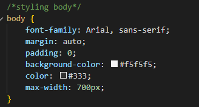

    -   **font-family**: jenis huruf utama Arial, jika tidak tersedia maka
        pakai sans-serif

    -   **margin: auto** : posisi konten berada di tengah

    -   **padding: 0** : tidak ada ruang dalam

    -   **background-color: #f5f5f5** : latar belakang abu-abu muda

    -   **color: #333** : warna teks abu tua

    -   **max-width: 700px** : lebar maksimal konten 700 piksel

    b.   **Styling Header**

    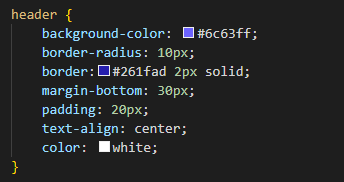

    -   **background-color: #6c63ff** : warna ungu cerah untuk latar belakang

    -   **border-radius: 10px** : sudut membulat

    -   **border: #261fad 2px solid** : garis tepi berwarna ungu gelap,
        tebal 2px

    -   **margin-bottom: 30px** : jarak bawah 30px

    -   **padding: 20px** : ruang dalam 20px

    -   **text-align: center** : isi teks rata tengah

    -   **color: white** : teks berwarna putih

    c.    **Styling Navigasi**

    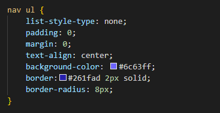
    
    -   **list-style-type: none** : menghilangkan tanda bullet

    -   **padding: 0** : tidak ada ruang dalam

    -   **margin: 0** : tidak ada ruang luar

    -   **text-align: center** : menu rata tengah

    -   **background-color: #6c63ff** : warna latar ungu cerah

    -   **border: #261fad 2px solid** : garis tepi ungu gelap

    -   **border-radius: 8px** : sudut sedikit melengkung

    d.   **Styling Nav ul li**

    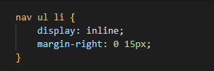

    -   **display: inline** : item list ditampilkan sejajar ke samping

    -   **margin-right: 0 15px** : memberi jarak kanan dan kiri (seharusnya
        ditulis margin: 0 15px)

    e.   **Styling Nav ul li a**

    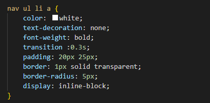

    -   **color: white** : teks link putih

    -   **text-decoration: none** : hilangkan garis bawah

    -   **font-weight: bold** : teks tebal

    -   **transition: 0.3s** : efek animasi halus saat hover

    -   **padding: 20px 25px** : ruang dalam atas-bawah 20px, kiri-kanan
        25px

    -   **border: 1px solid transparent** : garis tepi transparan

    -   **border-radius: 5px** : sudut membulat

    -   **display: inline-block** : supaya padding berfungsi penuh

    f.   **Styling nav ul li a:hover**

    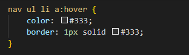

    -   **olor: #333** : teks berubah menjadi abu gelap saat diarahkan
        kursor

    -   **border: 1px solid #333** : muncul garis tepi abu gelap

    g.   **Styling Section**

    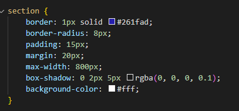

    -   **border: 1px solid #261fad** : garis tepi ungu gelap

    -   **border-radius: 8px** : sudut melengkung

    -   **padding: 15px** : ruang dalam 15px

    -   **margin: 20px** : jarak luar 20px

    -   **max-width: 800px** : lebar maksimal 800 piksel

    -   **box-shadow: 0 2px 5px rgba(0, 0, 0, 0.1)** : bayangan lembut di
        belakang kotak

    -   **background-color: #fff** : latar belakang putih

    h.   **Styling Footer**

    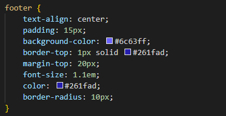

    -   **ext-align: center :** isi rata tengah

    -   **padding: 15px :** ruang dalam 15px

    -   **background-color: #6c63ff :** warna ungu cerah

    -   **border-top: 1px solid #261fad :** garis tepi bagian atas ungu
        gelap

    -   **margin-top: 20px :** jarak luar atas 20px

    -   **font-size: 1.1em :** ukuran teks lebih besar sedikit dari normal

    -   **color: #261fad :** teks berwarna ungu gelap

    -   **border-radius: 10px :** sudut membulat

    i.   **Styling Selektor Kelas .highlight**

    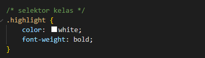

    -   **color: white** : teks berwarna putih

    -   **font-weight: bold** : teks tebal

    j.   **Styling selektor ID #pendidikan**

    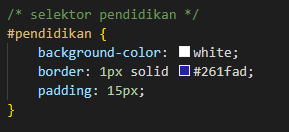

    -   **background-color: white** : latar belakang putih

    -   **border: 1px solid #261fad** : garis tepi ungu gelap

    -   **padding: 15px** : ruang dalam 15px

    k.   **Styling Selektor Atribut**

      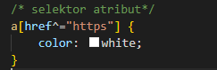

    -   **a\[href\^=\"https\"\]** : semua link yang alamatnya diawali dengan
        https

    -   **color: white** : warna link menjadi putih

    l.   **Styling Selektor Pseudo Kelas**

      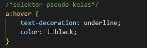

    -   **text-decoration: underline** : teks bergaris bawah saat diarahkan
    kursor

    -   **color: black** : teks berubah hitam

    m.   **Selektor Pseudo Elemen**

    

    -   **p::first-letter :** huruf pertama dari paragraf

    -   **font-size: 1em :** ukuran huruf sama dengan teks normal (bisa
        dibesarkan kalau mau efek lebih jelas)

    -   **color: #261fad :** huruf pertama berwarna ungu gelap

    n.   **Styling Kotak Info**
      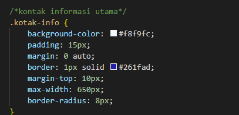

    -   **background-color: #f8f9fc** : warna abu sangat muda

    -   **padding: 15px** : ruang dalam 15px

    -   **margin: 0 auto** : posisi di tengah halaman

    -   **border: 1px solid #261fad** : garis tepi ungu gelap

    -   **margin-top: 10px** : jarak atas 10px

    -   **max-width: 650px** : lebar maksimal 650 piksel

    -   **border-radius: 8px** : sudut melengkung

    o.   **Box Content**

    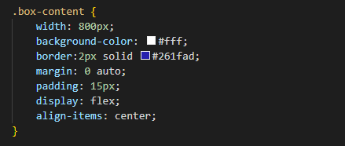

    -   **width: 800px :** lebar tetap 800 piksel

    -   **background-color: #fff :** latar belakang putih

    -   **border: 2px solid #261fad :** garis tepi ungu gelap, lebih tebal

    -   **margin: 0 auto :** posisi di tengah layar

    -   **padding: 15px :** ruang dalam 15px

    -   **display: flex :** menggunakan layout flexbox

    -   **align-items: center :** isi box disejajarkan vertikal di tengah

4.  **Kesimpulan**

Kode ini membentuk sebuah halaman profil atau CV yang terstruktur dan
mudah dinavigasi, menggunakan elemen HTML yang sesuai. Struktur header,
navigasi, dan sections memastikan halaman rapi dan informatif, sementara
footer menambah nilai dengan memberikan link sosial media. Hubungan
dengan file CSS eksternal memungkinkan penataan tampilan yang konsisten
dan menarik.
